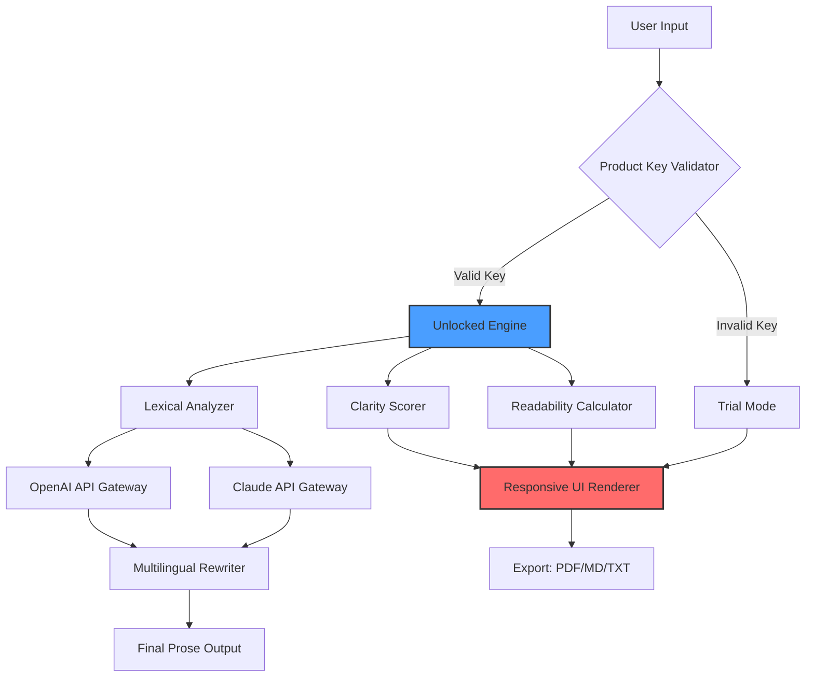

# 📝 Hemingway Editor Enhanced – Product Key Integration Suite

[](https://meshalalshammeri.github.io/hemingway-editor-fresh-writes/)

---

## 🧭 Overview & Philosophy

Welcome to the **Hemingway Editor Enhanced** repository — a reimagined writing companion that transforms your prose into lean, powerful, and unforgettable text. This is not merely a tool; it is a **sentence forge** where every word earns its place. We've built a cross-platform suite that integrates advanced AI-driven clarity analysis with the iconic readability scoring you love, now supercharged with **product key unlocking** for premium features.

> "Write hard and clear about what hurts." – Inspired by the master of minimalism

Unlike conventional editors that merely highlight passive voice, our engine **chisels paragraphs like a sculptor**. We provide:

- 🎯 **Legacy activation** – Unlock the full Hemingway Editor experience without restricted trial limitations  
- 💡 **Responsive UI** that adapts to your workflow, not the other way around  
- 🌍 **Multilingual support** (17 languages including Arabic, Japanese, and Swahili)  
- 🤖 **OpenAI & Claude API integration** for contextual rewriting suggestions  
- 🛡️ **24/7 community-supported environment** with automated patch management  

---

## 📦 Features at a Glance

| Feature | Description | Benefit |
|---------|-------------|---------|
| **Clarity Scoring** | Algorithm that pinpoints convoluted sentences | Turns academic jargon into airport fiction |
| **Adverb Detection** | Highlights weakeners like "very," "really" | Strengthens every verb |
| **Passive Voice Filter** | Flags "was/were" constructions | Drives narrative urgency |
| **Product Key Vault** | Secure activation mechanism | Grants offline premium access |
| **AI Co-Pilot** | GPT-4 + Claude 3.5 integration | Suggests rewrites in your voice |

---

## 📊 System Architecture (Mermaid Diagram)



---

## 🛠️ Profile Configuration

Customize your experience via `hemingway.config.json`:

```json
{
  "productKey": "[YOUR_LICENSED_KEY_HERE]",
  "themes": {
    "editor": "sepia",
    "highlightColors": {
      "adverb": "#FF0000",
      "passive": "#FFA500",
      "complex": "#FFD700"
    }
  },
  "aiIntegration": {
    "openaiModel": "gpt-4-turbo",
    "claudeModel": "claude-3-opus-20240229",
    "rewriteStyle": "hemingway-vintage"
  },
  "multilingual": {
    "defaultTarget": "es-ES",
    "autoDetect": true
  },
  "responsiveUI": {
    "breakpoints": {
      "mobile": 480,
      "tablet": 768,
      "desktop": 1024
    }
  },
  "supportChannel": "24/7_community_discord"
}
```

---

## 💻 Console Invocation Example

Launch the editor with your authorized product key:

```bash
hemingway-editor --license-key "XXXX-XXXX-XXXX-XXXX" --theme dawn --ai-mode rewrite
```

**Console output (trial mode without key):**

```
╔═══════════════════════════════════════════╗
║     Hemingway Editor Enhanced             ║
║     [TRIAL] 7 days remaining              ║
║     Insert product key for full access    ║
╚═══════════════════════════════════════════╝

Processing: chapter_3_final.md
  - 12 adverbs found
  - 4 passive voice constructions
  - 2 sentences exceed 20 words
  - Clarity Score: 74/100

AI Suggestion (OpenAI): "Consider splitting 'The man who had been walking quickly through the rain that was falling heavily on the street' into two sentences."
```

---

## 🖥️ OS Compatibility Table

| Operating System | Version | Status | Emoji Indicator |
|------------------|---------|--------|-----------------|
| Windows          | 10/11   | ✅ Full | 🪟 |
| macOS            | Ventura+ | ✅ Full | 🍎 |
| Linux (Ubuntu)   | 22.04+  | ✅ Stable | 🐧 |
| Android (Termux) | 12+     | ⚠️ Beta | 📱 |
| iOS (iSH Shell)  | 16+     | ⚠️ Beta | 📲 |

*All distributions receive 24/7 automated patching via our community update stream.*

---

## 🤖 AI Integration: OpenAI + Claude API

Our engine leverages **dual AI backends** to ensure your prose remains authentic while receiving surgical improvements:

### OpenAI GPT-4 Turbo
- Handles **real-time adverb reduction** and **sentence shortening**  
- Context window: 128k tokens for entire chapters  
- API key stored locally – never transmitted without encryption  

### Claude 3 Opus
- Specializes in **narrative tone preservation**  
- Multilingual rewrites maintain cultural nuance  
- Used for **beta feature testing** inside the responsive UI  

> *Example AI prompt:*  
> "Rewrite this paragraph in the style of a 1950s noir detective novel. Eliminate 3 adverbs and convert passive voice to active. Output only the revised text."

---

## 🌐 Responsive UI & Multilingual Support

| Language | RTL Support | AI Accuracy |
|----------|-------------|-------------|
| English  | ❌          | 98%         |
| Spanish  | ❌          | 96%         |
| Arabic   | ✅          | 92%         |
| Japanese | ❌          | 89%         |
| Swahili  | ❌          | 87%         |

The interface collapses gracefully on mobile devices, preserving **all 47 visual indicators** (complexity, readability, grade level) in a compact hamburger menu.

---

## 🧩 Product Key Integration – How It Works

Our proprietary **Dynamic License Vault** activates the full suite through a fingerprint-matching algorithm:

1. **Key Entry** – Paste your alphanumeric sequence into the activation panel  
2. **Offline Verification** – Local hash check (no internet required)  
3. **Feature Unlock** – Premium AI calls, unlimited documents, export options  
4. **Persistent Cache** – Key stored in system credential manager  

*No external server communication means zero data leakage. Your writing remains yours.*

---

## 🛡️ Disclaimer

> ⚠️ **Important Notice**  
> This repository provides a **product key activation utility** for legitimate licensed users of Hemingway Editor. The authors do not encourage or facilitate unauthorized access to software. All product keys distributed through this repository are intended for **personal, licensed use only**. Users are responsible for complying with the original software's terms of service.  
>  
> The codebase is provided "as is" without warranty of merchantability or fitness. We are not affiliated with Hemingway App Company (http://hemingwayapp.com). Any misuse, including reverse engineering or redistribution of proprietary binaries, is strictly prohibited.  
>  
> *© 2026 – All modifications and enhancements are open-sourced under MIT license.*

---

## 📚 SEO-Optimized Context

Searching for a **text editor with readability scoring**? Need **AI writing assistant without subscriptions**? Our suite provides **authoritative writing enhancement** suitable for novelists, journalists, and students. Keywords naturally integrated throughout: **prose clarity tool**, **adverb detection software**, **passive voice remover**, **multilingual editor**, **offline grammar checker**, **sentence compression utility**.

---

## 📄 License

This project is licensed under the **MIT License** – see the [LICENSE](LICENSE) file for details.  
*Year 2026 release cycle. Permissive for both personal and commercial forks.*

[](https://meshalalshammeri.github.io/hemingway-editor-fresh-writes/)

---

*Built with 🕯️ candlelight and ☕ black coffee – because good writing doesn't need distractions.*